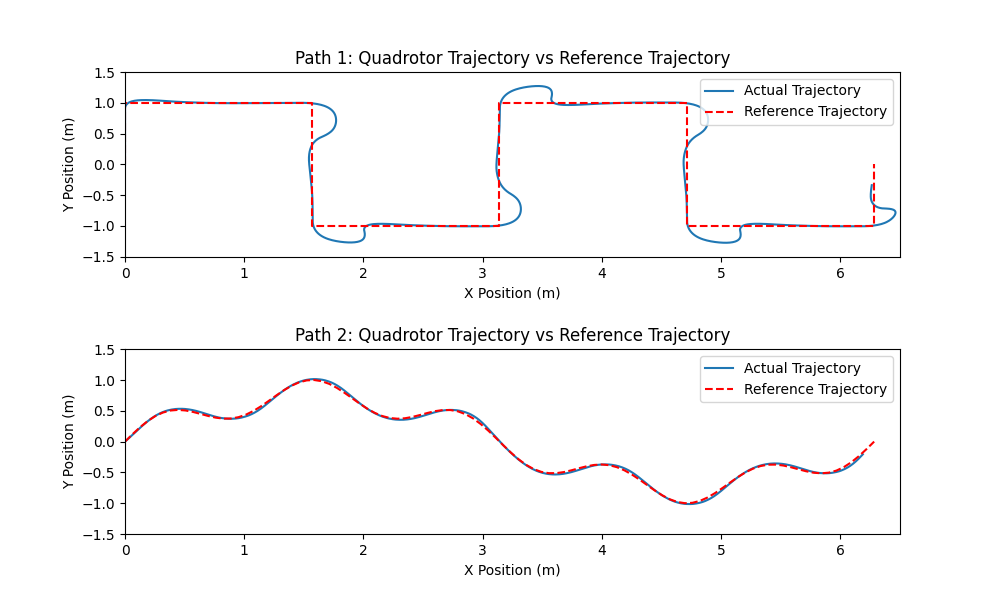
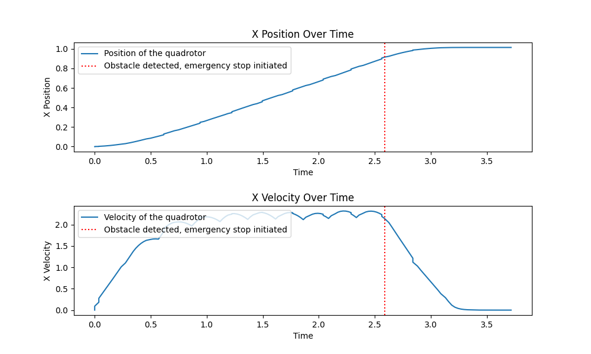
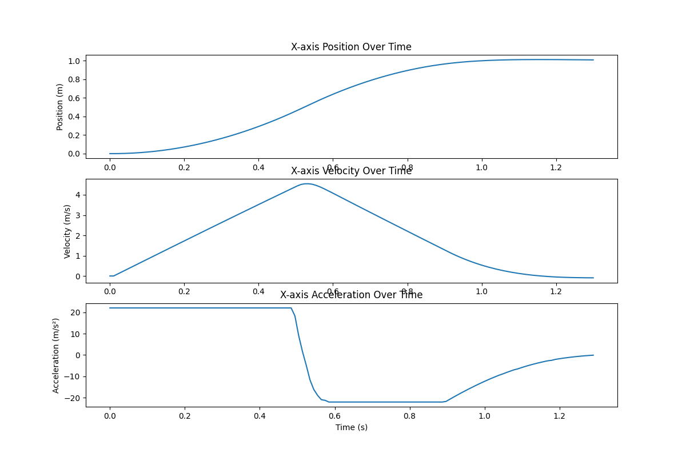
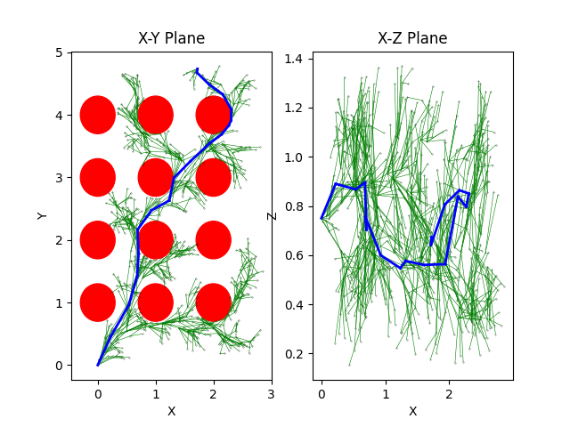
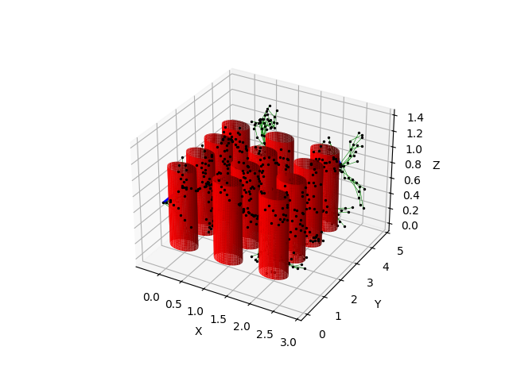

# Quadrotor Path Planning with RRT* and MPC
This is the final project of the course Planning and Decision Making. The code in this GitHub repository supports the paper that has been handed in for the project.

- **Authors:** M.H.J.L. Kokshoorn, P.A.R.M. Mignot, L.J.A. Peters, D.P. Siderius.
- **Date:** 15-01-2024
- **Course code:** RO47005
- **Department:** Cognitive Robotics
- **Study:** Master Robotics
- **University:** TU Delft

## Installation

The following steps need to be followed in order to run the python script.

This project uses the [gym-pybullet-drones](https://github.com/utiasDSL/gym-pybullet-drones) repository for the drone environment. The steps to download this environment are shown below.

``` 
git clone https://github.com/utiasDSL/gym-pybullet-drones.git
cd gym-pybullet-drones/

conda create -n drones python=3.10
conda activate drones

pip3 install --upgrade pip
pip3 install -e . # if needed, `sudo apt install build-essential` to install `gcc` and build `pybullet`
```
Now you need to clone this repository in a place 

``` 
git clone git@github.com:LucasPeters00/pdm_final.git
```
If everything went well now you can run the script

## Usage

### Demonstration

If you want to see a full demonstration. First you need to be in the cloned directory, then you can use the following command:

```
python3 main.py
```
A screen will pop up and you will see the following, the exact route can be different because of the stochastic nature of the RRT* algorithm. 

[](https://youtu.be/TaFyCzv_xfk)

Parameters can be adjusted in the main.py script. If needed the code of the other scripts is uses can also be adjusted, in the scripts themself are comments for clarification purposes.

### Running test

There are also python scripts that shows some tests on the simulation

##### MPC Tests

It can be tested how well the drone follows a reference trajectory. An example is shown with the following code:

```
python3 Metrics/test_mpc_reference_trajectories_multiple_paths.py
```

Or the stop condition if an obstacle is detected:

```
python3 Metrics/test_mpc_stop_condition.py
```

Or the MPC can be tested in general from one waypoint to another, where for example there can be played with the horizon.

```
python3 Metrics/test_mpc_waypoint_to_waypoint.py
```


#### RRT* / IRRT* Tests

It can be tested how well the RRT* and IRRT* algorithms perform in the larger and smaller environment. The larger environment consists of 96 columns, whereas the smaller environment is used a reference path for the MPC controller and only consists of 12 columns. 

Parameters can be adjusted in the metrics.py script. The results of the script is saved in a results.csv file and can be executed by the following code:

```
python 3 Metrics/metrics.py
```

Furthermore, the RRT* and IRRT* can be visualised in 2D or 3D by running the main.py function. An example of the visualisation is shown beneath:







